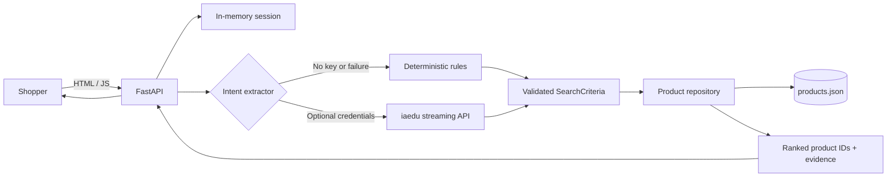
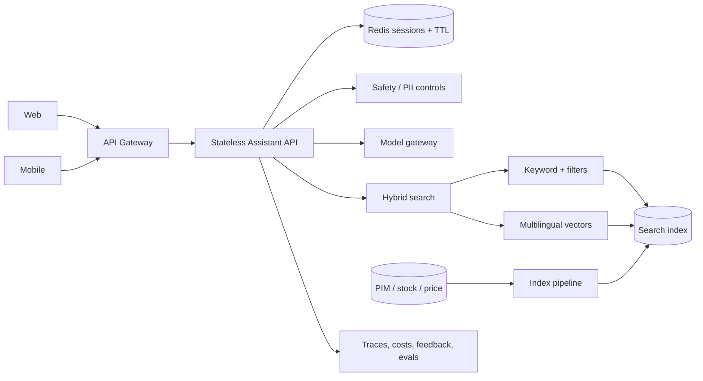

# Architecture overview

## Prototype

The browser sends the message, session ID and optional selected product IDs to `POST /api/chat`. The interface language is local to the browser; FastAPI detects the conversational language from the message and recent session context before extracting structured criteria.

When `IAEDU_API_KEY`, `IAEDU_API_ENDPOINT` and `IAEDU_CHANNEL_ID` exist, FastAPI calls the configured iaedu streaming endpoint. The backend sends only the current message, an anonymous per-session thread ID and an empty `user_info` object. It buffers the response, validates the returned JSON against the Pydantic `SearchCriteria` model, and never sends product facts or user profile data to the provider. Without complete credentials—or after any provider error—the same contract is produced by local rules.

The model never returns product cards. Python applies hard constraints, ranks known products and serialises facts from `products.json`. This boundary prevents invented prices, dimensions or sustainability claims.

## Main components

| Component | Responsibility |
|---|---|
| Jinja2 template | Accessible page shell served by Python |
| Vanilla JavaScript | Chat interaction, comparison selection and product modal |
| FastAPI | HTTP contracts, static assets and OpenAPI documentation |
| Intent extractor | Local or optional LLM conversion into structured criteria |
| Assistant service | Conversation orchestration and localised response templates |
| Repository | Catalogue validation, hard filtering and explainable ranking |
| In-memory store | Short-lived messages, language, criteria and last product IDs |
| JSON catalogue | Fictional source of truth for all displayed product facts |

## Key technical decisions

### Retrieval before presentation

Products, prices and evidence are selected by deterministic Python code. The LLM is limited to intent extraction. This is less conversational than a second generation call, but it improves groundedness, latency, cost and testability.

### Hard constraints before ranking

Category, maximum price, compact dimensions, colour, material and sustainability are filters. Rating and budget headroom influence ranking only after constraints pass. A high-rated product can never bypass a stated budget.

### Evidence-based sustainability

A product qualifies for a sustainability filter only if its catalogue record contains specific evidence. The UI shows that evidence and states that it is not a complete lifecycle assessment.

### In-memory session for the MVP

The store is thread-safe, expires inactive sessions and preserves the last product IDs for follow-ups. It is deliberately not production-ready: a restart loses data and multiple worker processes would not share state.

### Provider failure is non-fatal

The provider has a twelve-second timeout. Authentication, quota, timeout or malformed-response errors fall back locally, so discovery remains available.

## Production evolution

The next retrieval layer should be **hybrid search**:

1. exact filters for market, stock, price, dimensions and variants;
2. keyword/BM25 matching for product names and precise terminology;
3. multilingual embeddings for style, use case and semantic similarity;
4. a learned or rules-based re-ranker using merchandising signals.

This preserves exact commerce constraints while improving vague requests such as “a calm Scandinavian reading corner”.

## Production data flow

1. Web/mobile sends the current message and an opaque session ID.
2. The API loads short-lived state from Redis.
3. Safety controls redact sensitive data and constrain supported intents.
4. Intent extraction produces a validated schema.
5. Hybrid search retrieves only market-valid, in-stock products.
6. A response layer cites retrieved fields and returns a stable UI contract.
7. Anonymous outcome events and explicit feedback feed offline evaluations.

## Scaling

Thousands of users per day is moderate scale. Stateless FastAPI workers behind a load balancer, Redis for sessions, a managed search index and provider timeouts are sufficient. Cache popular anonymous queries and apply per-session rate limits. Keep checkout, price and stock systems authoritative.

## Risks and mitigations

| Risk | Mitigation |
|---|---|
| Invented product facts | Allow only repository products and serialise source-of-truth fields |
| Stale price or stock | Incremental indexing; validate again at product page/checkout |
| Greenwashing | Store and display evidence; avoid unsupported aggregate scores |
| Prompt injection | Treat catalogue copy as data; use strict schemas and allowlisted operations |
| Provider outage or cost spike | Timeout, fallback, caching, token caps and usage alerts |
| Session privacy | Data minimisation, Redis TTL, PII redaction and consent for personalisation |
| Ranking bias | Curated evaluation set, segment analysis and merchandiser review |

## AI services

- iaedu streaming API for optional structured intent extraction.
- The iaedu agent is instructed to return only a `SearchCriteria` JSON object; the Python contract validates it before use.
- No embedding model in the prototype; multilingual embeddings are explicitly a production next step.
